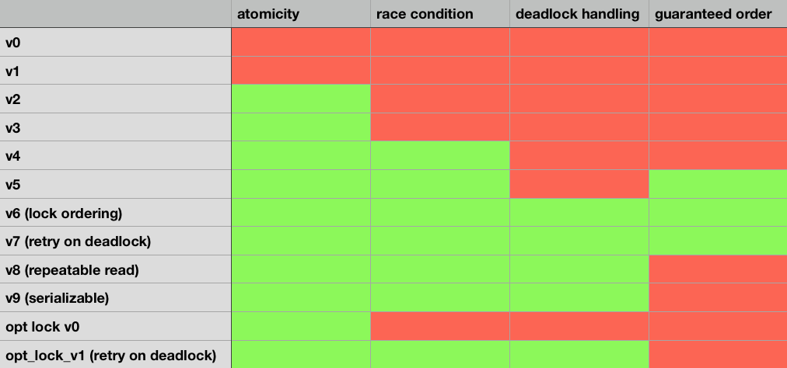
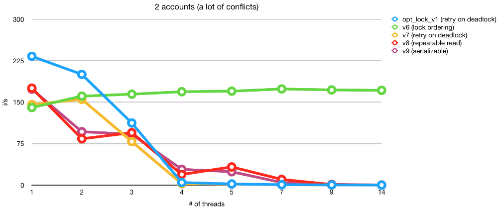
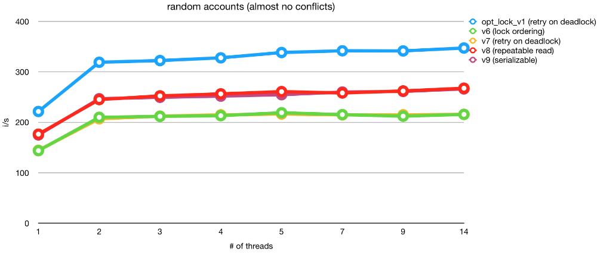

# Alice and Bob transfers money

## Illustrating repository for the presentation

Setup:
```sh
git clone git@github.com:rabotyaga/alicenbob.git
bundle
rails db:setup
```

Tests:
```
bundle exec rspec
```

Tests output should be like:
```
Finished in 13.16 seconds (files took 0.82014 seconds to load)
47 examples, 10 failures

Failed examples:

rspec ./spec/services/transfer_balance/opt_lock_v0_spec.rb:12 # TransferBalance::OptLockV0 with conflicting parallel operations fails all but one
rspec ./spec/services/transfer_balance/opt_lock_v1_spec.rb[1:1:4:1] # TransferBalance::OptLockV1 behaves like fully operational with conflicting parallel operations preserves order
rspec ./spec/services/transfer_balance/v0_spec.rb:8 # TransferBalance::V0 with invalid transfer both balances stay unchanged
rspec ./spec/services/transfer_balance/v1_spec.rb:8 # TransferBalance::V1 with invalid transfer both balances stay unchanged
rspec ./spec/services/transfer_balance/v2_spec.rb:12 # TransferBalance::V2 with conflicting parallel operations fails all but one
rspec ./spec/services/transfer_balance/v3_spec.rb:12 # TransferBalance::V3 with conflicting parallel operations fails all but one
rspec ./spec/services/transfer_balance/v4_spec.rb:16 # TransferBalance::V4 with conflicting parallel operations preserves order
rspec ./spec/services/transfer_balance/v5_spec.rb[1:1:5:1] # TransferBalance::V5 behaves like fully operational with non conflicting parallel operations handles deadlocks
rspec ./spec/services/transfer_balance/v8_spec.rb[1:1:4:1] # TransferBalance::V8 behaves like fully operational with conflicting parallel operations preserves order
rspec ./spec/services/transfer_balance/v9_spec.rb[1:1:4:1] # TransferBalance::V9 behaves like fully operational with conflicting parallel operations preserves order
```

which means




Benchmarks:
```
RAILS_ENV=test bundle exec rake benchmark
```




